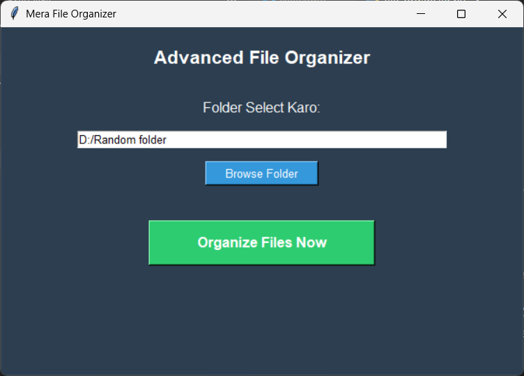
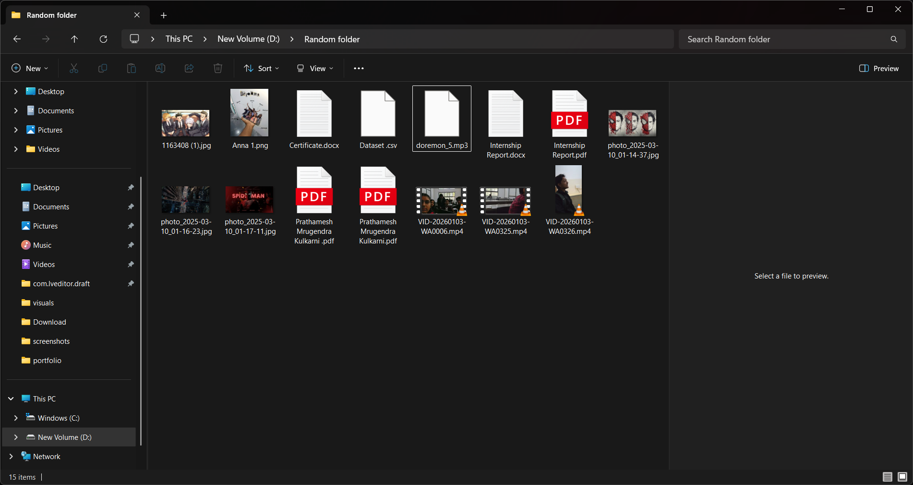
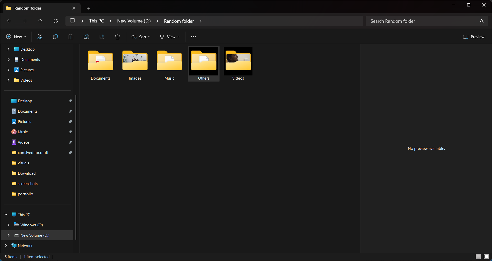
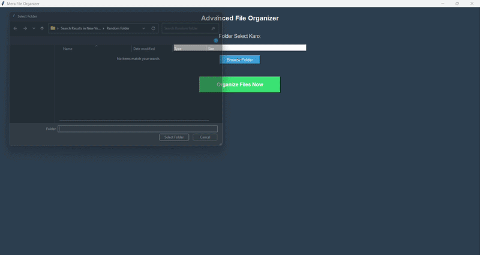

# 🗂️ File Organizer

A simple Python desktop tool that automatically organizes messy folders by sorting files into categorized subfolders based on their file type — Images, Documents, Videos, Music, and Others.

## Features

- **One-click folder organization** — Select any folder and organize it instantly
- **Smart categorization** — Automatically sorts files into:
  - 🖼️ Images (`.jpg`, `.jpeg`, `.png`, `.gif`, `.bmp`)
  - 📄 Documents (`.pdf`, `.doc`, `.docx`, `.txt`, `.ppt`, `.xlsx`)
  - 🎬 Videos (`.mp4`, `.mkv`, `.mov`)
  - 🎵 Music (`.mp3`)
  - 📦 Others (anything that doesn't match the above)
- **Simple GUI** — No command-line knowledge needed, just browse and click

## Tech Stack

- **Python 3**
- **Tkinter** — GUI
- **os / shutil** — File system operations

## How It Works

1. Select a folder using the "Browse Folder" button
2. Click "Organize Files Now"
3. The script scans every file in the folder, checks its extension, and moves it into a matching subfolder (creating the subfolder if it doesn't exist)

## How to Run

```bash
# Clone the repository
git clone https://github.com/kulkarniprathamesh97/file-organizer.git
cd file-organizer

# Run the app (no external dependencies needed)
python file_organizer.py
```

## Screenshots

## Screenshots

**Main Window**


**Before — Messy Folder**


**After — Organized Folder**


## Demo


## Future Improvements

- Undo option to revert the last organization
- Custom category rules (let users define their own file type groups)
- Support for organizing by date or file size
- Drag-and-drop folder selection

---

Built by [Prathamesh Kulkarni](https://github.com/kulkarniprathamesh97)